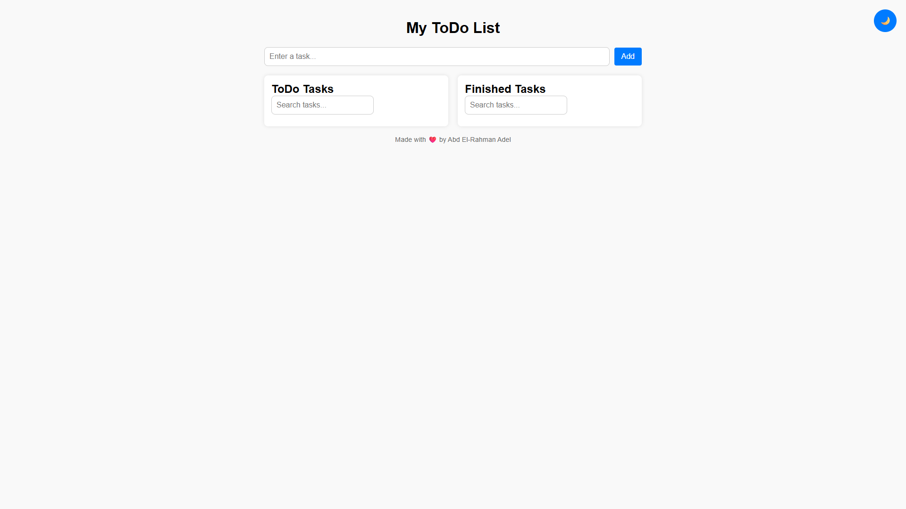
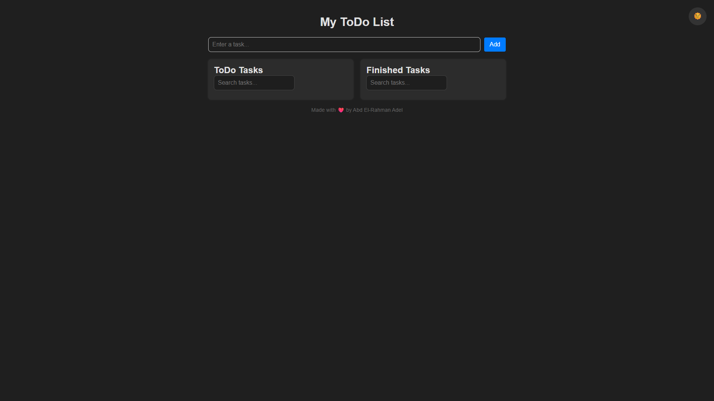
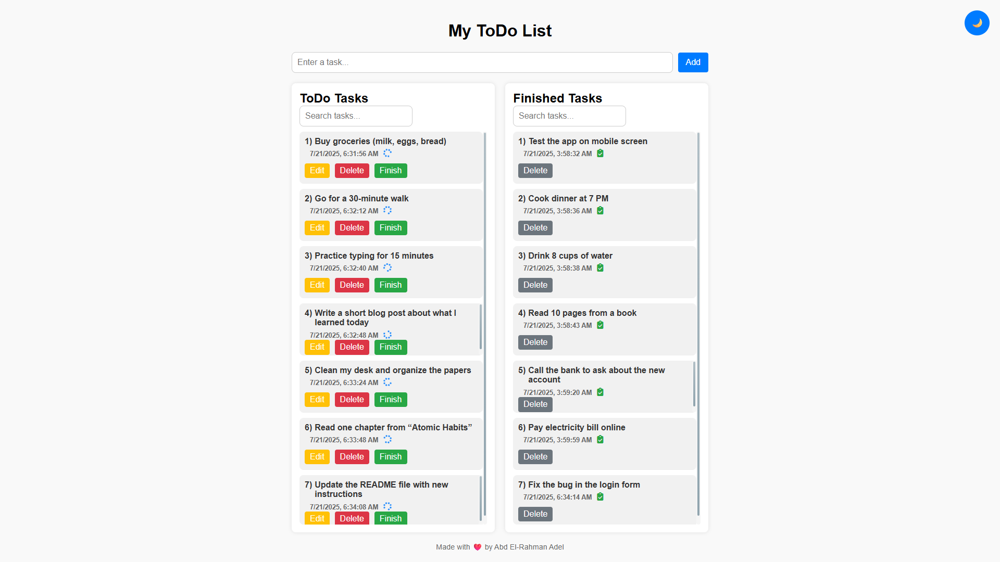
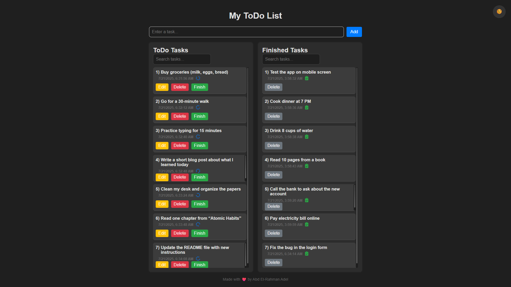
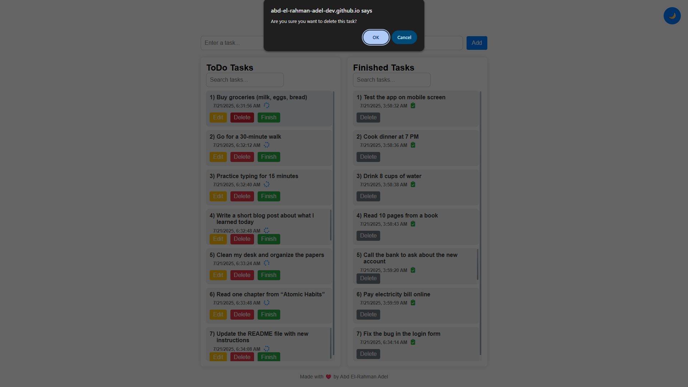
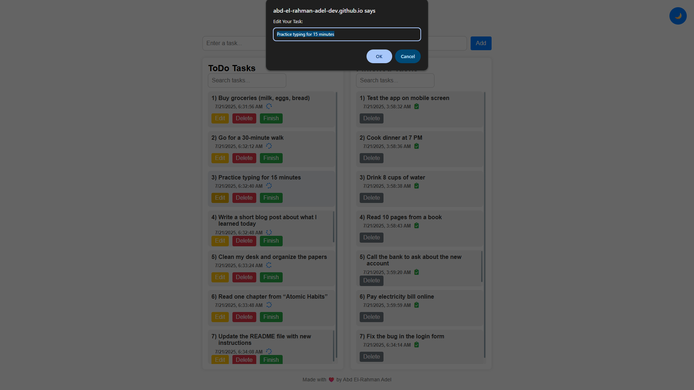

# ✅ ToDo List App

A simple yet powerful **ToDo List Application** built using **HTML5**, **CSS3**, and **Vanilla JavaScript**.  
This project allows users to manage their daily tasks effectively with features like adding, editing, deleting, and marking tasks as done.

---

## 🚀 Live Demo

📍 [View Live](https://abd-el-rahman-adel-dev.github.io/todo-list-js/) <!-- عدل الرابط لو عندك صفحة شغالة -->

---

## 📸 Screenshots








---

## ✨ Features

- ✅ Add new tasks
- 📝 Edit existing tasks
- 🗑️ Delete tasks
- ✔️ Mark tasks as completed
- 🔄 Move tasks between **"To Do"** and **"Completed"** sections
- 💾 Local storage support (optional enhancement)
- 💻 Fully responsive and mobile-friendly

---

## 🛠 Tech Stack

- **HTML5**
- **CSS3**
- **JavaScript (ES6)**

> ⚡ 100% Vanilla JS – No external libraries or frameworks used.

---

## 📦 Getting Started

To run the project locally:

```bash
git clone https://github.com/abd-el-rahman-adel-dev/todo-list-js.git
cd todo-list-js
open index.html
```

Or just double-click `index.html` in your file manager.

---

## 📁 Project Structure

```
📦 todo-list-js
┣ 📂 css
┃ ┗ 📜 style.css
┣ 📂 js
┃ ┗ 📜 main.js
┣ 📂 images
┃ ┗ 📜 icons, backgrounds...
┣ 📂 screenshots
┃ ┗ 📜 home.png, tasks.png
┣ 📜 index.html

```

---

## 📄 License

This project is licensed under the [MIT License](./LICENSE).

---

## 🙋‍♂️ Author

- [Abd El-Rahman Adel](https://github.com/abd-el-rahman-adel-dev)
- [LinkedIn](https://www.linkedin.com/in/abdelrahman-adel-webdev)

---

> ⭐ If you like this project, feel free to star the repo and use the template for your own apps.
